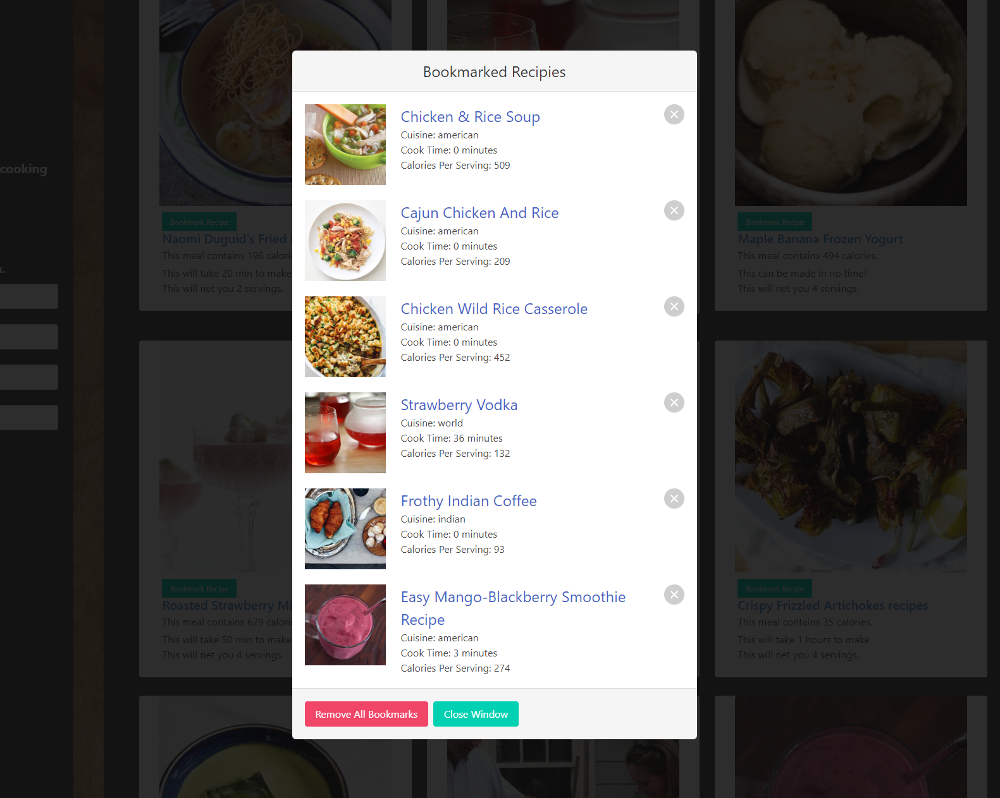

# Meal Recipe Generator

## Description

Provide a short description explaining the what, why, and how of your project. Use the following questions as a guide:

- What was your motivation?
    - To showcase our skills by building a more complex site using JavaScript, a CSS Framework and multiple API calls.
- What problem does it solve?
    - Helps the end users be able to find new foods that they may enjoy by searching for types of foods or even ingredients.
- What did you learn?
    - How to use the Bulma CSS framework.
    - How to merge conflicts more effectively.
    - Learned to be more efficient on reading development documentation
    - Became more familiar with the GitHub Project tool.

## Table of Contents (Optional)

- [Usage](#usage)
- [Credits](#credits)
- [License](#license)
- [Features](#Features)
- [How to Contribute](#How-to-Contribute)

## Usage

- This application allows for you to be able to search for recipes using the cuisine type (examples Japanese or Italian), meal type (Breakfast, Lunch, Dinner), how much time it takes to cook or even by selecting up 4 ingredients in the meal. Once searched, you can then page forward to see additional results or go backwards to see previous pages. While looking through recipes and when you find ones that are interesting you can then bookmark them for future reference. These bookmarks have a interface to access and they can be cleared out individually, or they can be cleared out in mass via the interface.

    - This webpage can be viewed by following the below link:
        - https://garrettwinter.github.io/meal-recipe-generator/
        
    - Below a screenshots of the webpage
        - Screenshot of Main site with results:
        - 

        - Screenshot of the Bookmark feature with saved recipes:
        - 

## Credits

List your collaborators, if any, with links to their GitHub profiles.

- Garrett Winter -- https://github.com/garrettWinter
- Mohamed Farah -- https://github.com/moxamadfarax
- Blake M -- https://github.com/blakem64
- Colton Knaak -- https://github.com/ColtonKnaak

If you used any third-party assets that require attribution, list the creators with links to their primary web presence in this section.
    - CSS Framework -- https://bulma.io/
    - Custom Font -- https://use.fontawesome.com/releases/v5.14.0/js/all.js"
    - Primary API used -- https://www.edamam.com/
    - Secondary API used -- https://developers.giphy.com/

## License

MIT License

Copyright (c) 2022 Garrett Winter

Permission is hereby granted, free of charge, to any person obtaining a copy
of this software and associated documentation files (the "Software"), to deal
in the Software without restriction, including without limitation the rights
to use, copy, modify, merge, publish, distribute, sublicense, and/or sell
copies of the Software, and to permit persons to whom the Software is
furnished to do so, subject to the following conditions:

The above copyright notice and this permission notice shall be included in all
copies or substantial portions of the Software.

THE SOFTWARE IS PROVIDED "AS IS", WITHOUT WARRANTY OF ANY KIND, EXPRESS OR
IMPLIED, INCLUDING BUT NOT LIMITED TO THE WARRANTIES OF MERCHANTABILITY,
FITNESS FOR A PARTICULAR PURPOSE AND NONINFRINGEMENT. IN NO EVENT SHALL THE
AUTHORS OR COPYRIGHT HOLDERS BE LIABLE FOR ANY CLAIM, DAMAGES OR OTHER
LIABILITY, WHETHER IN AN ACTION OF CONTRACT, TORT OR OTHERWISE, ARISING FROM,
OUT OF OR IN CONNECTION WITH THE SOFTWARE OR THE USE OR OTHER DEALINGS IN THE
SOFTWARE.

## Features

Some of the large features of this site are:

- Bookmarking favorite recipes
- Modal Overlay to access bookmark data
- Pagination
- Robust Local Storage for persistent data
- Clear button functional for recipes results
- Dynamic Giphy display based on user inputs
- Included attribution for Edmamam and Giphy APIs

## How to Contribute

If you would like to help us develop this application further, below is a list of additional feature and functions that we had thought about as part of this development but have yet been able to get to.

    - Add drop down value for “dishType” some example categories of this are:
    - Main Courses, Deserts, Drinks, Sandwiches…
    - Add form validation for alpha characters only on ingredient text fields.
    - Add loading icon to screen when the API call is running.
    - Add an ingredient button to the search results, to trigger modal showing all ingredients for that recipe.
    - Enhance bookmarking to allow user to categorize favorite items.
    - Show nutritional data and have user be able to search on that.
